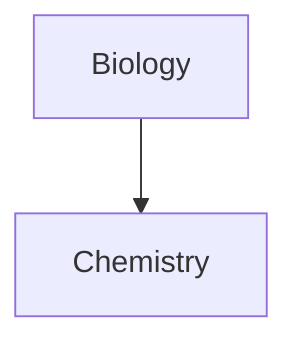

# Obsidian知识体系搭建

**_懒人目录：_**

-   一、基础篇
-   Obsidian简介
-   Markdown语法
-   二、功能篇
-   标签面板/关系图谱/插件
-   三、操作篇
-   1、新建笔记/创建双链……
-   2、自定义主题/安装插件/多端同步

## **一、基础篇**

## **Obsidian简介**
Obsidian是一共可以作为第二大脑、支持双向链接、基于**Markdown文件**的**本地**知识管理软件。

这句话，可能你不太理解，下面我对它进行拆分：

**_1、第二大脑_**

> 使用标签系统、Moc、双链，可以将非线性知识模块连接起来，形成属于自己的脑图。

**_2、双向链接_**

> 用`[[]]` 可以将关键词联系起来，只要点击关键词就可以跳转到与关键词相连的内容。

[[内部链接]]

**_3、基于Markdown文件的本地存储_**

> 可以很方便的转移自己的笔记，并且是本地存储的，所以安全性十足。

## **Markdown语法**

_Markdown是一种可以使用普通文本编辑器编写的标记语言，通过简单的标记语法，它可以使普通文本内容具有一定的格式。_

而且使用MD创作也并不需要懂得所有语法，只需要记住下面几个常用的就行！

**标题**、**加粗**、*斜体*、**==高亮==**
![[Pasted image 20220506101518.png]]

## **二、功能篇**

**标签面板**

> 标签是一个组织大量笔记的好方法，它能让你更容易找到笔记。标签本质上是一个可点击的检索按钮，点击它 Obsidian 就会自动为你搜索包含这个标签的笔记。比如，点击 #标签 这个标签后，Obsidian 将会显示库中所有包含这个标签的笔记。标签有各种不同的用法，比如标明笔记的来源或是笔记的种类。Zettelkasten 方法的使用者则会将标签作为连接笔记、连接想法的“切入点”。总而言之，这是一个非常灵活的功能，我们相信你可以把它玩出花儿来。(官方解答)

首次使用需要在设置-核心插件里面打开「标签面板」

标签相比树状文件夹分类得更加详细以及具体，它不局限于一共文档，可以在文档中任何地方，只要你觉得这段话很有特点，就可以添加`#标签`  

**关系图谱**

> 关系图谱显示了你笔记之间的[[内部链接]]。笔记被链接得越多，图谱上对应的节点就越大。

同样，需要在设置-核心插件里面打开`「关系图谱」`

**插件**

> Obsidian 强大的地方在于它能以插件的形式增加新功能。

**检索**

搭建知识库/笔记，有一点很重要`检索`；当笔记数量很多时，很难查找到文件所在位置，这个时候就需要`检索`

## **三、操作篇**

## **_基础教程_**

**1、新建库文件**

在电脑上新建文件夹，给文件夹命名；然后Obsidian上选择「打开库文件夹」

**2、新建笔记**

按下快捷键`Ctrl+N`，或者在控制面板左上角点击「新建笔记」按钮

  

**3、创建双链**

Obsidian 支持多种「超链接」形式，例如：

-   双向链接：`[[笔记名]]`
-   笔记标题引用`[[笔记名#标题]]`
-   块引用：`[[笔记名 ^]]`
-   ……

**4、添加图片**

在Obsidian中输入`![[图片名.jpg]]`

> 注意：`.jpg`属于文件扩展名，根据自己的图片修改

**5、添加视频**

本地视频，直接`![[视频.MP4]]`

在线视频，可以将“iframe”将网页嵌入到笔记中。
![[https://www.bilibili.com/video/BV1Xt4y1Q7eS?t=150.1]]
> [!todo]

> [!note]

> [!question]-
> hello

- [ ] hello 
- [ ] this 
- [ ] is 
- [ ] task
- [ ] !